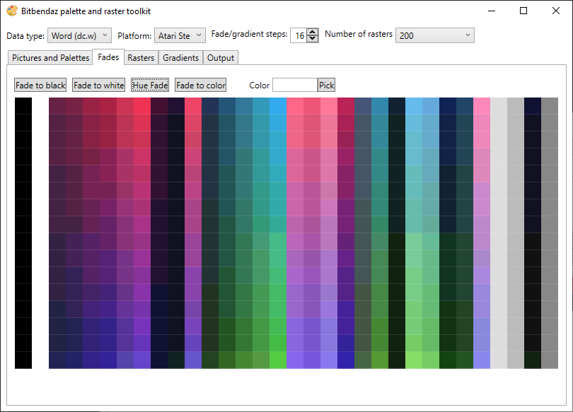

# Bitbendaz palette and raster toolkit
- Modify, remap and tweak palettes with RGB or HSL.
- Generate fades with variable steps and export them to Motorola 68k assembler
- Generate rasters and export them to Motorola 68k assembler
- Generate simple gradients

Supported target platforms:
- Amiga, 4096 colors palette (12-bit RGB)
- Atari STe, 4096 colors palette (12-bit RGB)
- Atari ST, 512 colors palette (9-bit RGB)

Supported image formats:
- Degas PI1, 16 colors
- IFF, any color range up to 256 colors

This is the ultimate tool to tweak palette and raster data to use in demos/games.

Inspired by the fade calculator and the rasterbar generator from Simon Sunnyboy/Paradize.

**Work in progress!**

## Requirements
- .NET Core 3.
- VisualStudio 2019 is recommended for compiling the WPF client.

## Documentation

### Settings
Shown at the top of the tool:
- Data type allows you to control which datatype the generated assembler code will use.
- Platform allows you to toggle output/remapping color mode
- Fade/gradient steps controls how many steps fades and gradients shall use
- Number of rasters controls how many raster items to show/edit

### Pictures and Palettes tab
Click **Browse** to load a picture (PI1 or IFF). When loaded, the picture and the palette will be shown.
Two palettes are actually shown, the active palette which can be modified by clicking a color and the original palette below.

Click **Reset** to restore the original palette.

Modify a hex-value in the palette textbox and click **Update** to apply the new color.

#### Adjusting HSL 
Adjust Hue, Saturation and Lightness with the sliders.
The generated palette will be shown in the **Active Palette**.

----

### Fades

- Click **Fade to black** to generate a fade from the loaded picture's palette which fades to black in the active number of steps.
- Click **Fade to white** to generate a fade from the loaded picture's palette which fades to white in the active number steps.
- Click **Hue Fade** to generate a fade from the loaded picture's palette to the adjusted HSL palette in the active number of steps.
- Click **Fade to color** to generate a fade from the loaded picture's palette to the color selected to the right of this button. The fade will use the selected number of steps.

When a fade is generated, the generated assembler code will be shown in the **Output** tab. The generated palette data-matrix will be shown at the active tab.

----

### Rasters
This tab allows you to create, preview and export raster-data.
The tab is divided into four main columns:

#### Picture preview:
* Click **Load** to load a picture used for the previewing
* Click **Refresh** to refresh the preview image with the defined raster data
* Change **Mask color** to control which color in the picture the raster data will be merged into

#### Color picker
* Use the color picker to change color for the selected item in the Raster list

#### Raster list
Displays all raster items with index, color and remapped hexcode per item.
- **Select** a color to change it with the Color picker
- Copy the selected color by pressing **Ctrl+C** or click the Copy button
- Paste a copied color to one or more selected items with **Ctrl+V** or click the Paste button
- Create a gradient between the first selected color and the last selected color by clicking the **Make gradient** button
- Click the **Paste Asm** button to paste raster data from the clipboard in dc.w assembler syntax. The data will automatically be parsed and shown.
- Click **Load** to load saved raster data
- Click **Save** to save the current raster data
- Click **Generate** to generate assembler raster data. The generated data is shown in the *Output tab*

#### Preview
Displays a preview of the definied raster data. The selected index is shown to the left of the preview in red.

----

### Gradients
Generate a gradient between the start color and the end color with the selected number of steps. Change the colors either by entering a hex-code for the color (RGB) or click **Pick** to select a color.

Click **Generate** to generate the gradient and a preview.

----

### Output
Generated assembler data from the *Fades* and *Raster list* page is shown here.

## Sample code
(Unoptimized) sample code for Atari STe available in the *Samples/Atari* folder:
- **fade_spl.s**: Fade a picture using a generated fade.
- **rast_spl.s**: Show rasters using TimerB with VBL/HBL.

## Contributing
Pull requests are welcome. For major changes, please open an issue first to discuss what you would like to change.

## License
[Beerware](https://en.wikipedia.org/wiki/Beerware)

## 3rd party libs
The IFF-LBM reader is based on Pavel Torgashows implementation:
https://github.com/PavelTorgashov/IFF-ILBM-Parser

Created by [Mikael Stalvik (Stalvik^Bitbendaz)](https://demozoo.org/sceners/27448/)

https://www.facebook.com/BitBendaz/
