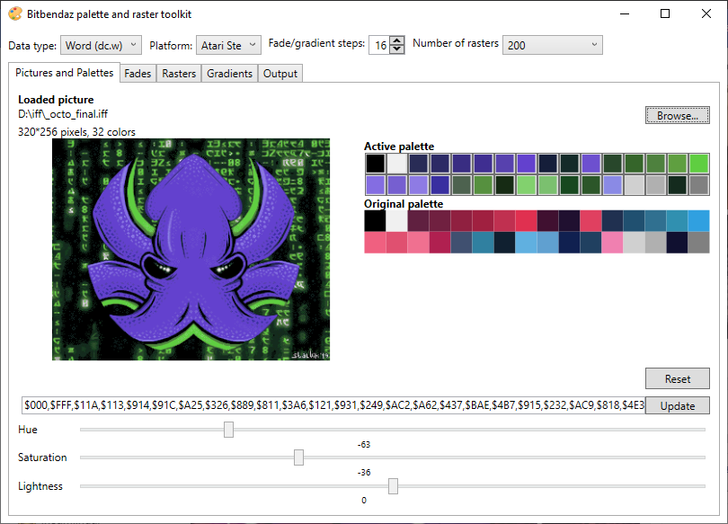

# Bitbendaz Atari STe palette and raster toolkit
Calculate AtariSte palettes, tweak palettes, export palettes to Motorola 68000 assembler code, create fades and generate gradients/rasters.
This is the ultimate tool to tweak palette data from Degas PI1 files.

**Work in progress!**

## License
[Beerware](https://en.wikipedia.org/wiki/Beerware)

Created by [Mikael Stalvik (Stalvik / Bitbendaz)](https://demozoo.org/sceners/27448/)

